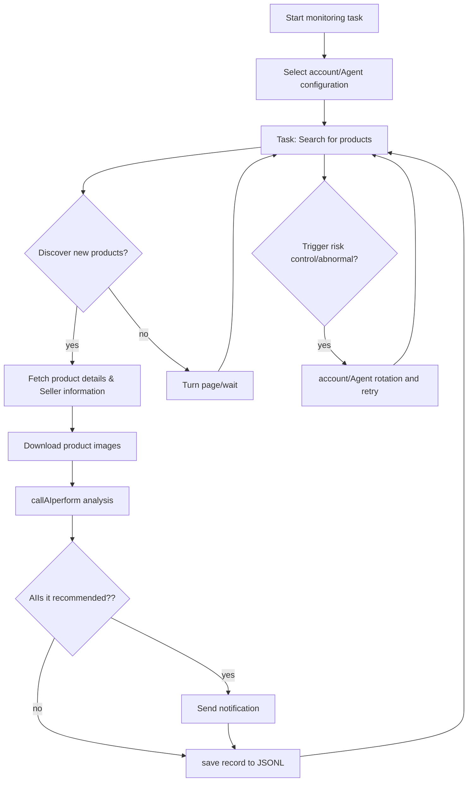

# Xianyu intelligent monitoring robot

based on Playwright and AI The Xianyu multi-task real-time monitoring tool provides a complete Web Management interface。

Experience address：[Click here to experience it online](https://sxceimnfdrpp.ap-northeast-1.clawcloudrun.com)

Login password：admin/admin123

## Core features

- **Web Visual management**: Task management, account management、AI Standard editing and running logs、Browse results
- **AI drive**: Natural language creation tasks, multi-modal model in-depth analysis of products
- **Multitasking concurrently**: Independently configure keywords and prices、Filter criteria and AI Prompt
- **Advanced filtering**: Free shipping, new release time range、Province/city/District three level area screening
- **Instant notification**: support ntfy.sh、Enterprise WeChat、Bark、Telegram、Webhook
- **Timing scheduling**: Cron Expression configuration periodic tasks
- **Account and agent rotation**: Multiple account management, task binding account、Agent pool rotation and failure retry
- **Docker deploy**: One-click containerized deployment

## screenshot


## quick start

### Environmental preparation

**Require**:
- Python 3.10+
- Node.js + npm（for front-end builds）
- Playwright Browser dependencies (executed when not installed) `playwright install chromium`）

```bash
git clone https://github.com/Usagi-org/ai-goofish-monitor
cd ai-goofish-monitor
```

### Configuration

1. **Create configuration file**

```bash
cp .env.example .env
```

2. **Core configuration items**

| variable | illustrate | Required |
|------|------|------|
| `OPENAI_API_KEY` | AI Model API Key | yes |
| `OPENAI_BASE_URL` | API Interface address (compatible with OpenAI Format） | yes |
| `OPENAI_MODEL_NAME` | Multimodal model name (e.g. `gpt-4o`） | yes |
| `WEB_USERNAME` / `WEB_PASSWORD` | Web Interface login credentials (default `admin` / `admin123`） | no |
| `NTFY_TOPIC_URL` | ntfy.sh Notification address | no |
| `BARK_URL` | Bark push address | no |
| `WX_BOT_URL` | Enterprise WeChat Webhook（Need to be surrounded by double quotes） | no |

Complete configuration item reference `.env.example`

3. **Start service**

```bash
chmod +x start.sh && ./start.sh
```

start.sh Will automatically complete dependency installation, front-end construction and back-end startup。

4. **access Web UI**
access `http://127.0.0.1:8000`，
**Login default password(admin/admin123)** → **Xianyu account management**，Use as prompted [Chrome Expand](https://chromewebstore.google.com/detail/xianyu-login-state-extrac/eidlpfjiodpigmfcahkmlenhppfklcoa) Extract and paste login status JSON。
The account will be saved to `state/` directory (e.g. `state/acc_1.json`）。Later in**task management**Select Bind Account to start using it。

## 🐳 Docker deploy

use `docker-compose.yaml` One-click startup, the image has preset front-end construction and running environment。

### 1) Prepare(This step can be skipped, after startingUIIt can also be configured on the page)

```bash
cp .env.example .env
vim .env
```

### 2) start up

```bash
docker compose up -d
```

### 3) Access and management

- **access Web UI**: `http://127.0.0.1:8000`
- **View log**: `docker compose logs -f app`
- **Stop service**: `docker compose down`
Account status is saved in the container by default `/app/state`，If persistence is required, you can compose Add mount in `./state:/app/state`。

### 4) Update image

```bash
docker compose pull
docker compose up -d
```

## Web UI Function overview

<details>
<summary>Click to expand Web UI Feature details</summary>

- **task management**：AI Create and edit parameters、Task scheduling, account binding
- **Xianyu account management**：Add to/renew/Delete account and import login status JSON
- **View results**：Card browsing, filtering and sorting、View details
- **Run log**：Group by task, incremental loading、Auto refresh
- **System settings**：status check、Prompt Editing, agent rotation

</details>

## 🚀 Workflow

The following figure describes the core processing logic of a single monitoring task from startup to completion. in actual use，`src.app` It will serve as the main service and start one or more task processes based on user operations or scheduled schedules.。



## Web Interface authentication

<details>
<summary>Click to expand the authentication configuration details</summary>

### Authentication configuration

WebInterface is enabledBasicAuthentication protection to ensure that only authorized users can access the management interface andAPI。

#### Configuration method

exist `.env` Set authentication credentials in file：

```bash
# WebService authentication configuration
WEB_USERNAME=admin
WEB_PASSWORD=admin123
```

#### Default credentials

if not in `.env` Set authentication credentials in the file, the system will use the following default values：
- username：`admin`
- password：`admin123`

**⚠️ Important: Please be sure to change the default password in the production environment！**

#### Certification scope

- **Authentication required**：allAPIendpoint、WebInterface, static resources
- **No certification required**：health check endpoint (`/health`)

#### How to use

1. **Browser access**：accessWebThe authentication dialog box will pop up when the interface appears.
2. **APIcall**：Need to be included in the request headerBasicCertification information
3. **front endJavaScript**：Authentication is automatically handled and no modification is required.

#### Security advice

1. Change the default password to a strong password
2. Production environment useHTTPSprotocol
3. Regularly change authentication credentials
4. Restrict access via firewallIPscope

For detailed configuration instructions, please refer to [AUTH_README.md](AUTH_README.md)。

</details>


## Acknowledgments

<details>
<summary>Click to expand the acknowledgments</summary>

This project referred to the following excellent projects during the development process, and I would like to express my gratitude：

- [superboyyy/xianyu_spider](https://github.com/superboyyy/xianyu_spider)

and thanksLinuxDoScript contributions from relevant people

- [@jooooody](https://linux.do/u/jooooody/summary)

and thanks [LinuxDo](https://linux.do/) Community。

and thanks ClaudeCode/Gemini/Codex and other model tools to free your hands experienceVibe Codingof happiness。

</details>

## experience

<details>
<summary>Click to expand project experience</summary>

This project 90%+ The code is composed ofAIgenerate, including ISSUE involved in PR 。

Vibe Coding The scary thing is that if you don’t participate too much in project construction, you willAIThe generated code is not carefullyreview，haven't thought about itAIWhy is it written like this? Blindly verifying function availability by running test cases will only cause the project to become a black box.。

Reuse the sameAIrightAIThe generated code proceedscode reviewwhen usingAIto verify anotherAIThe answer is noAI，Caught in a dilemma of self-certification, soAICan aid analysis, but should not be the arbiter of truth。


</details>

## Things to note

<details>
<summary>Click to expand the details of the precautions</summary>

- Please abide by Xianyu’s user agreement androbots.txtRule, don’t make too frequent requests，So as not to put a burden on the server or cause the account to be restricted。
- This project is only for learning and technical research, please do not use it for illegal purposes。
- This project uses [MIT license](LICENSE) Publish, press"status quo"provided without any guarantee of any kind。
- The project authors and contributors are not responsible for any direct or indirect consequences arising from the use of this software.、Liability for incidental or special damages or losses。
- For more details, check out [Disclaimer](DISCLAIMER.md) document。

</details>

## Star History

[](https://www.star-history.com/#Usagi-org/ai-goofish-monitor&Date)
